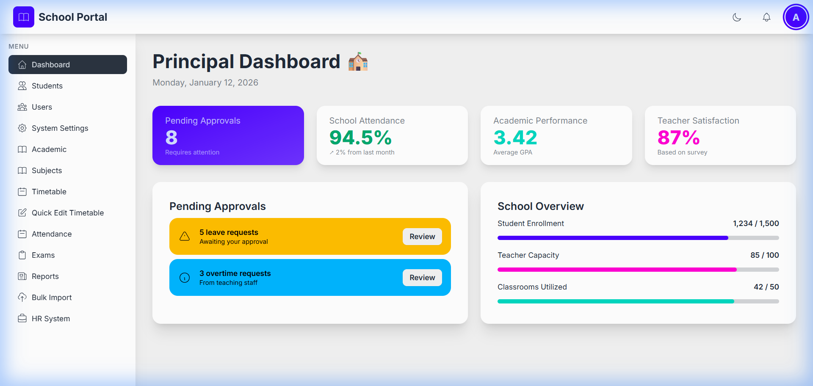
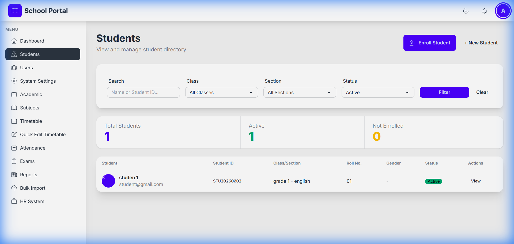
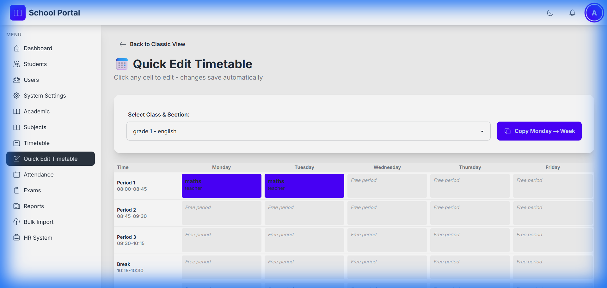
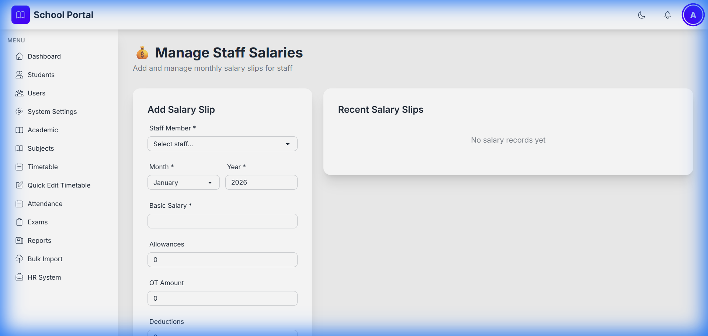

# 🏫 School Management Portal

<div align="center">


**A modern, comprehensive school management system with role-based access control, LMS features, and HR management.**

[Features](#-features) • [Installation](#-installation) • [Screenshots](#-screenshots) • [Tech Stack](#-technologies-used)

</div>

---

## 📸 Screenshots

<div align="center">

### Dashboard Overview


### Student Management


### Quick Edit Timetable


### HR - Salary Management


</div>

---

## ✨ Features

### 🎯 Core Features

#### 👥 User Management
- ✅ Multiple user roles: Student, Parent, Teacher, Leading Teacher, Admin, Principal
- ✅ Google OAuth SSO integration
- ✅ Role-based access control (RBAC)
- ✅ Profile management with photo upload

#### 📚 Learning Management System (LMS)
- ✅ Assignment creation and submission with file uploads
- ✅ Book reading tracker with progress monitoring
- ✅ Badge/achievement system with custom awards
- ✅ Digital resource library (PDFs, videos, documents)
- ✅ Gradebook integration with GPA calculation
- ✅ Quiz and assessment tools

#### 📊 Academic Management
- ✅ Comprehensive student information management
- ✅ Daily attendance tracking (students & staff)
- ✅ Examination and grading system with report cards
- ✅ Class, section, and subject management
- ✅ **Visual timetable editor** with drag-and-drop
- ✅ Academic year and semester management
- ✅ Automated report card generation

#### 💼 HR System
- ✅ Leave request management with multi-level approval
- ✅ Overtime tracking and calculation
- ✅ **Monthly salary slip management**
- ✅ Staff attendance monitoring
- ✅ Performance tracking

#### 👨‍👩‍👧 Parent Portal
- ✅ View children's grades and attendance in real-time
- ✅ Access homework and assignment submissions
- ✅ Direct communication with teachers
- ✅ Fee statements and payment history

#### 📈 Reporting & Analytics
- ✅ Interactive attendance reports with charts
- ✅ Academic performance dashboards
- ✅ Class and student progress tracking
- ✅ Trend analysis with visual graphs
- ✅ Export reports to PDF

#### 🌐 Progressive Web App (PWA)
- ✅ Installable on mobile devices
- ✅ Offline support for critical features
- ✅ Push notifications (planned)
- ✅ Responsive design for all screen sizes

---

## 🚀 Installation

### ⚙️ Requirements
- PHP 7.4 or higher
- MySQL 5.7 or higher
- Apache/Nginx web server
- cURL extension enabled (for Google OAuth)
- GD Library (for image processing)

### 📥 Setup Instructions

#### 1️⃣ Clone/Download the project
```bash
# Clone the repository
git clone https://github.com/yourusername/school-portal.git

# Or download and extract to your web server
# Place in: C:\xampp\htdocs\sp (Windows)
# Or: /var/www/html/sp (Linux)
```

#### 2️⃣ Configure Google OAuth (Optional but Recommended)
- Go to [Google Cloud Console](https://console.cloud.google.com/)
- Create a new project or select an existing one
- Enable Google+ API
- Create OAuth 2.0 Client ID under **Credentials**
- Add authorized redirect URI: `http://localhost/sp/oauth-callback.php`
- Copy `config/google-oauth.template.php` to `config/google-oauth.php`
- Add your Client ID and Secret to the file

#### 3️⃣ Run Installation Wizard
- Navigate to `http://localhost/sp/setup/install.php`
- Follow the step-by-step wizard:
  - **Step 1**: Welcome and requirements check ✅
  - **Step 2**: Database configuration and creation 🗄️
  - **Step 3**: Create admin account 👤
- The wizard automatically creates the database and schema

#### 4️⃣ Login and Start Using
- Navigate to `http://localhost/sp`
- Login with your admin credentials
- Start configuring: Add academic years → Create classes → Add users
- Enroll students and assign teachers

### 🔐 Default Credentials (After Installation)
Use the credentials you created during the installation wizard.

### 🗄️ Default Database Settings (XAMPP)
```
Host: localhost
Database: school_portal
Username: root
Password: (blank)
```

---

## 📖 Usage

### User Roles

**Principal**
- Full system access
- Approve leave and overtime requests
- View school-wide analytics
- Manage all users

**Admin**
- Manage students and teachers
- Configure academic settings
- Create classes and subjects
- Generate reports

**Teacher**
- Mark student attendance
- Create and grade assignments
- Enter exam grades
- Award badges to students
- Request leave/overtime
- View salary details

**Student**
- View grades and report cards
- Submit assignments
- Track reading progress
- View achievements/badges
- Check attendance

**Parent**
- View children's information
- Access grades and attendance
- View homework assignments
- Communicate with teachers

## Project Structure

```
sp/
├── config/             # Configuration files
├── classes/            # PHP classes (Auth, GoogleOAuth)
├── includes/           # Common includes (header, footer, sidebar, functions)
├── dashboard/          # Role-based dashboards
├── modules/            # Feature modules
│   ├── students/       # Student management
│   ├── teachers/       # Teacher management
│   ├── attendance/     # Attendance tracking
│   ├── academic/       # Academic settings
│   ├── exams/          # Examination and grading
│   ├── lms/            # Learning management
│   ├── hr/             # HR system
│   ├── reports/        # Reporting
│   └── profile/        # User profile
├── assets/             # CSS, JS, and image assets
│   ├── css/            # Custom styles
│   └── js/             # JavaScript files
├── uploads/            # User-uploaded files
├── database/           # Database schema
└── setup/              # Installation wizard
```

## Security Features

- Password hashing with bcrypt
- CSRF token protection
- SQL injection prevention (PDO with prepared statements)
- XSS protection
- Session security
- Role-based access control
- File upload validation

## Technologies Used

- **Backend**: PHP 7.4+
- **Database**: MySQL/MariaDB
- **Frontend**: HTML5, JavaScript (Vanilla)
- **CSS Framework**: Tailwind CSS + DaisyUI
- **Authentication**: PHP Sessions + Google OAuth 2.0
- **Charts**: Chart.js

## Browser Support

- Chrome (latest)
- Firefox (latest)
- Safari (latest)
- Edge (latest)

## Future Enhancements

- Email notifications
- SMS integration
- Biometric attendance integration
- Mobile application
- Advanced report builder
- Fee management module
- Library management
- Transport management
- Hostel management

## Support

For issues or questions:
1. Check the installation wizard for common setup issues
2. Verify all PHP extensions are enabled
3. Ensure database credentials are correct
4. Check file permissions for uploads directory

## License

This project is open-source and available for educational purposes.

## Credits

- **UI Components**: DaisyUI
- **Icons**: Heroicons (built into Tailwind CSS)
- **Fonts**: Google Fonts (Inter)
- **Charts**: Chart.js

---

**Note**: This is a comprehensive school management system. After installation, configure Google OAuth for SSO, create users with appropriate roles, and set up academic years before regular use.
